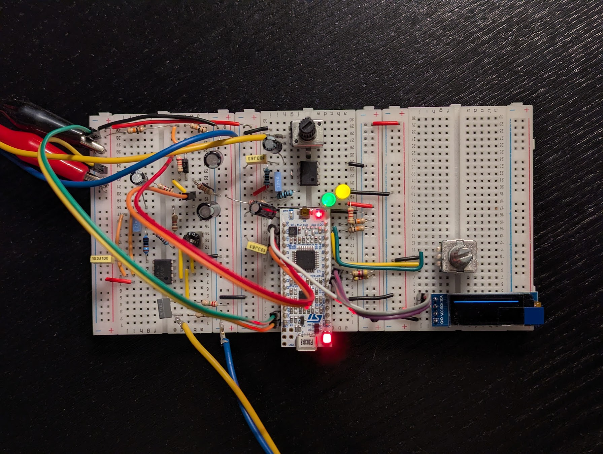

# guitar-me

## Overview
A work-in-progress guitar multieffects platform, based on an STM32F303 microcontroller and its integrated analog peripherals.



## Features
- [x] Analog signal conditioning including anti-aliasing and reconstruction filters
- [x] Real-time audio processing pipeline with DMA and double buffering
- [x] Performance monitoring via busy/idle LED brightness
- [x] Decimation and interpolation (CMSIS-DSP)
- [x] Configurable peak IIR filter (CMSIS-DSP)
- [x] Rotary encoder support for user control (via timer)
- [x] Basic I2C OLED display configuration
- [ ] Button support, second encoder and advanced user control interface
- [ ] Displaying meaningful information on the OLED
- [ ] Solving OLED I2C's interference with real-time processing (DMA, maybe FreeRTOS?)
- [ ] Analog stage optimisation and PCB design

## Build and run
```bash
cmake --preset [debug/release]                          # configure
cmake --build --preset [debug/release]                  # build
cmake --build --preset [debug/release] --target flash   # build and flash
./debug.sh                                              # debug with openocd and gdb
```

